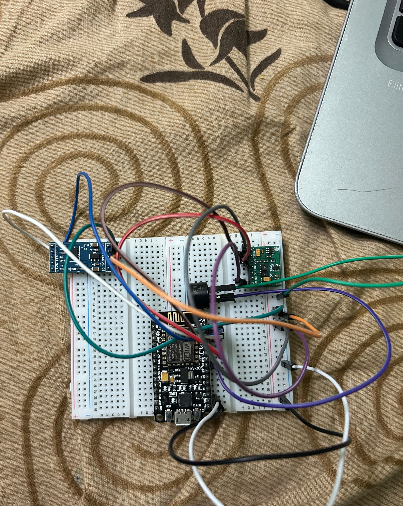

# Secure IoT-Based Health Monitoring System Overview

This project implements a secure, embedded IoT health monitoring system using ESP8266 (NodeMCU). The system monitors heart rate and fall detection in real-time and transmits encrypted telemetry data to a backend server for critical alert analysis. The system is designed with embedded firmware, wireless communication, and on-device encryption principles.

## System Architecture

```
MAX30100 Pulse Sensor | ADXL345 Accelerometer |
         (I2C)
         |
    ESP8266 Firmware
    WiFi (TCP + AES Encrypted HTTP)
         |
    Flask Backend Server
         |
    Critical Alert Dashboard
```

## Embedded Firmware Features

- I2C sensor interfacing (MAX30100, ADXL345)
- Real-time heart rate monitoring
- Accelerometer calibration and magnitude-based fall detection
- Event-driven anomaly detection
- AES encryption of telemetry data before transmission
- Manual HTTP POST construction over TCP
- Basic Authentication header implementation
- GPIO-based alert mechanism (buzzer)
- Timing logic using millis() for non-blocking control

## Backend Server Features

- Flask-based REST endpoint (/update)
- Base64 decoding and JSON parsing
- Critical condition detection (Fall + Heart Rate > 100 BPM)
- In-memory data logging
- Critical alerts API (/critical-alerts)
- Real-time dashboard UI
- Debug endpoints for monitoring system state

## Critical Condition Logic

A critical alert is triggered only when:
- Fall is detected AND Heart rate exceeds 100 BPM

This reduces false positives and ensures emergency alerts are meaningful.

## Hardware Components

- ESP8266 NodeMCU
- MAX30100 Pulse Oximeter
- ADXL345 Accelerometer
- Buzzer
- Breadboard + jumper wires

## Hardware Prototype




## Technologies Used

### Embedded
- Embedded C (Arduino framework)
- I2C communication
- TCP sockets over WiFi
- AES encryption
- Base64 encoding

### Backend
- Python Flask
- JSON processing

## How to Run

### Backend Server

```bash
pip install -r requirements.txt
python app.py
```

Server runs at: `http://0.0.0.0:5000`

## Learning Outcomes

- Embedded firmware development on ESP8266
- Sensor integration via I2C
- Secure telemetry transmission
- TCP-level HTTP construction
- Event-driven embedded logic
- Real-time alert system design

## Disclaimer

All credentials and API keys are removed for security. Replace placeholders with your own development credentials.
